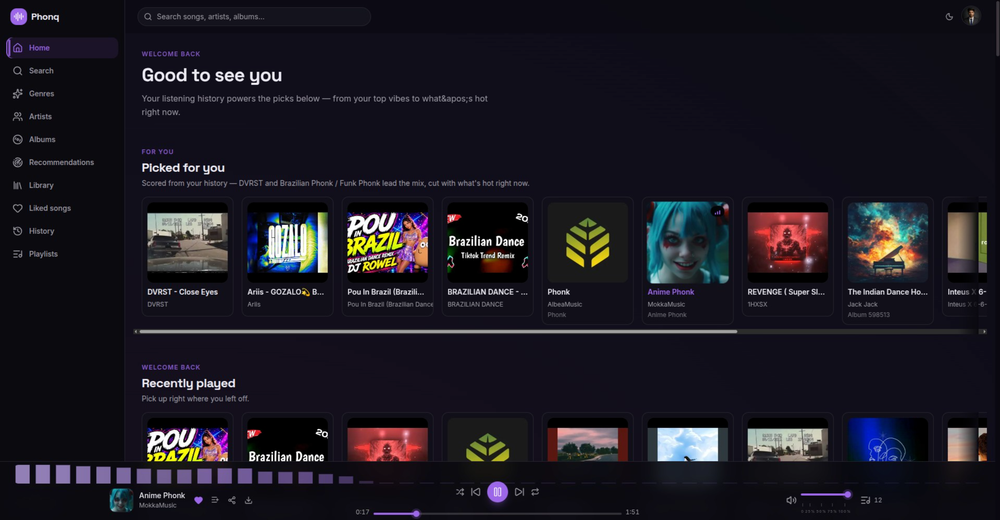
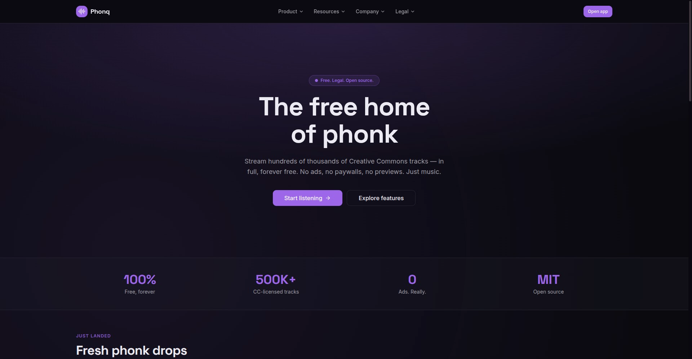

# Phonq — The free home of phonk


[](LICENSE)
[](https://github.com/hexsyro/Phonq/actions)
[](https://nextjs.org)
[](https://typescriptlang.org)
[](https://neon.tech)
[](https://github.com/hexsyro/Phonq/discussions)

Phonq is a free, open-source music streaming platform built for the phonk community.
Stream hundreds of thousands of Creative Commons tracks — legally, in full, forever free.

---

## What is Phonq?

Phonq streams the entire Jamendo catalog (500K+ CC-licensed tracks) with:

- **A real music player** — full-length streaming, a live waveform visualizer (Web Audio API), a persistent queue with drag-to-reorder, shuffle, repeat and volume control
- **Live discovery** — trending phonk charts and fresh drops straight from the API, plus genre radios
- **Full-catalog search** — tracks, artists, albums, tags and BPM
- **Your library** — favorites, playlists and listening history that sync across devices via Google OAuth 2.0
- **Artist and album pages** — full discographies, bios, similar-artists recommendations and album metadata (cover art, release date) built from a live to DB to static fallback
- **Personalized recommendations** — tracks surfaced from your listening history, favorite subgenres and similar artists
- **Zero ads, zero paywalls** — and legally free downloads where the artist allows

And it's 100% open source under the MIT license. Fork it, audit it, self-host it, or build on it.

---

## Screenshots

The gallery below is filled with real captures from the App. Drop your own
`docs/screenshots/*.png` in and link them here.

| The App | Landing Page |
| ----------------- | ---------------- |
|  |  |

> Short GIFs of the live waveform / queue help too — see
> [Contributing → Screenshots](CONTRIBUTING.md).

## Tech Stack

| Layer     | Technology                                                        |
| --------- | ----------------------------------------------------------------- |
| Framework | [Next.js 16](https://nextjs.org) (App Router, Turbopack)          |
| Language  | TypeScript 5.9                                                    |
| Styling   | Tailwind CSS 4 (OKLCH phonk-purple theme)                         |
| Auth      | Auth.js v5 (NextAuth) + Google OAuth 2.0 + email magic links       |
| Database  | [Neon](https://neon.tech) PostgreSQL via Prisma 7 (driver adapter)|
| Music     | [Jamendo API](https://developer.jamendo.com) — CC-licensed tracks, cached in Postgres with a static fallback snapshot |
| Deploy    | Vercel (serverless, ready) + Docker for self-hosting               |
| Testing   | Vitest (unit + API route tests)                                    |

## Project Structure

```
phonq/
├── prisma/
│   ├── schema.prisma         # Users, playlists, favorites, listens
│   ├── seed.ts
│   └── migrations/
├── src/
│   ├── app/
│   │   ├── (marketing)/      # Public site: /, /login, product, resources, company, legal
│   │   ├── app/              # Authenticated app: /app/home, search, library, playlists…
│   │   └── api/              # Route handlers (/api/tracks, /api/me/*)
│   ├── components/
│   │   ├── ui/               # Button, Card, Dialog, DropdownMenu, Slider…
│   │   ├── player/           # PlayerContext, PlayerBar, QueuePanel, Waveform
│   │   ├── track/            # TrackCard, TrackRow, LikeButton, AddToPlaylist
│   │   └── layout/           # Nav, Footer, AppSidebar, AppHeader
│   ├── content/              # Marketing content (features, FAQ, legal, blog…)
│   ├── lib/                  # jamendo client, auth, prisma, rate-limit, api helpers
│   └── generated/prisma/     # Prisma client (generated — don't edit)
```

See [ARCHITECTURE.md](ARCHITECTURE.md) for the full technical design.

## Prerequisites

- Node.js 20+ (built and tested on 24)
- A free [Neon](https://neon.tech) PostgreSQL database
- A free [Jamendo client_id](https://devportal.jamendo.com) (register an app)
- A [Google OAuth](https://console.cloud.google.com/apis/credentials) client ID + secret

## Setup

```bash
# 1. Install dependencies
npm install

# 2. Configure environment
cp .env.example .env
#   fill in DATABASE_URL, JAMENDO_CLIENT_ID, AUTH_SECRET,
#   AUTH_GOOGLE_ID, AUTH_GOOGLE_SECRET, NEXT_PUBLIC_APP_URL

# 3. Create the database schema
npx prisma migrate dev

# 4. Run the dev server
npm run dev          # → http://localhost:3000
```

> **Jamendo client_id**: Phonq cannot ship with a working public key — Jamendo suspends
> shared test keys. Create your own (free, 2 minutes) at
> [devportal.jamendo.com](https://devportal.jamendo.com). Without one, the app degrades
> gracefully: it serves whatever is cached in Postgres, then a bundled static snapshot,
> and surfaces a friendly "catalog is refreshing" message instead of a raw API error.
>
> **YouTube key (optional)**: set `YOUTUBE_API_KEY` to enable the hybrid catalog. Jamendo
> stays the default (legal, direct audio, no quota), and YouTube fills genre gaps — e.g.
> Brazilian funk — with tracks played through the YouTube IFrame Player API. Searches are
> cached in Postgres (`youtube_video_mappings`), so the 100 searches/day free budget lasts
> indefinitely once the catalog is seeded. See [.env.example](.env.example).

## Scripts

| Script                | Description                            |
| --------------------- | -------------------------------------- |
| `npm run dev`         | Start the dev server (Turbopack)       |
| `npm run build`       | Generate Prisma client + production build |
| `npm run start`       | Serve the production build             |
| `npm run lint`        | ESLint                                 |
| `npm run typecheck`   | `tsc --noEmit`                         |
| `npm test`            | Run the Vitest suite                   |
| `npm run sync:featured` | Refresh the static fallback snapshot with real Jamendo data |
| `npm run sync:youtube`  | Bulk-seed a genre from a YouTube playlist (playlistItems.list) |
| `npm run db:generate` | `prisma generate`                      |
| `npm run db:deploy`   | `prisma migrate deploy`                |
| `npm run db:studio`   | Open Prisma Studio                     |

## Self-hosting with Docker

The repo ships a `docker-compose.yml` that runs the app with a local Postgres — no
Neon, no cloud, no cost:

```bash
cp .env.example .env    # pre-wired to the local Postgres already
docker compose up --build
# → http://localhost:3000
```

The first boot runs the migrations automatically and seeds the schema. See
 [.env.example](.env.example) for every variable.

## Deploying to Vercel

One-click deploy (prompts for the same env vars documented below):

[](https://vercel.com/new/clone?repository-url=https%3A%2F%2Fgithub.com%2Fhexsyro%2FPhonq&project-name=phonq&env=DATABASE_URL%2CAUTH_SECRET%2CAUTH_GOOGLE_ID%2CAUTH_GOOGLE_SECRET%2CNEXT_PUBLIC_APP_URL)

Or manually:

1. Push this repo to GitHub and import it in Vercel.
2. Add the same env vars as `.env` in **Project → Settings → Environment Variables**.
3. Deploy. Run `npx prisma migrate deploy` once (via a Vercel build step or locally) to create the tables.

## How this stays free

Phonq runs on free tiers and stays free forever:

- **Music** — the Jamendo API is free for non-commercial use; tracks are streamed straight
  from their CDN (never through our servers).
- **Database** — Neon's free tier easily covers the catalog cache and user library.
- **Hosting** — Vercel's free tier (or your own Docker/Postgres box).
- **We never sell ads or data.** If you want to keep the lights on and the features coming,
  sponsoring is the best way to help:

[](https://github.com/sponsors/hexsyro)

## Contributing

Contributions are welcome — docs, translations, bug fixes, features. See
[CONTRIBUTING.md](CONTRIBUTING.md), the [Code of Conduct](CODE_OF_CONDUCT.md), and
the [security policy](SECURITY.md). In short:

```bash
git clone https://github.com/hexsyro/Phonq
cd Phonq && npm install
# make your changes…
npm run lint && npm run typecheck && npm test
```

Questions and ideas are welcome on
[GitHub Discussions](https://github.com/hexsyro/Phonq/discussions).

## License

MIT — see [LICENSE](LICENSE). Music is licensed by its artists under Creative Commons via
[Jamendo](https://www.jamendo.com); Phonq does not own the catalog.

---

<center><i>Built with ❤️ for the phonk community · <a href="https://github.com/hexsyro">@hexsyro</a></i></center>
